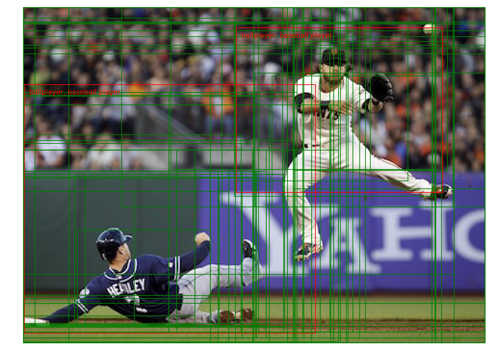
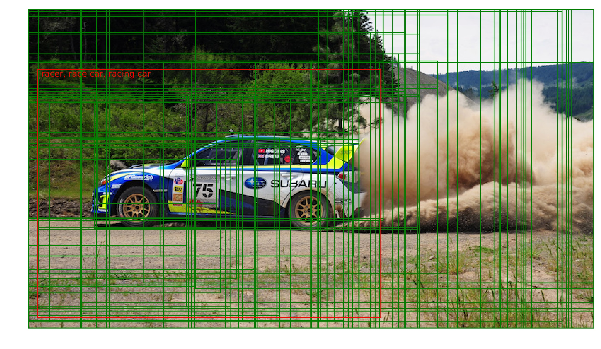

# selective-search-caffe
Object Recognition using Caffe with Selective Search

This is a tutorial to do object recognition using a Caffe pre-trained model and selective search. Although this isn't the most efficient approach to object recognition, it's still fairly fast and the approach is intuitive. To run this project, you'll need to have Caffe and Dlib installed.

Here's a breakdown of the steps for object recognition:  
1. Run selective search on the image. This returns numerous "regions of interest" within the image. These regions were deemed "interesting" based on selective search's algorithm for image segmentation. I use the Dlib implementation of selective search.  
2. Run the CaffeNet classifier on each region of interest. CaffeNet has 1000 classes, so each region returns 1000 probabilities (each probability corresponding to a single class).   
3. Put a bounding box around the object of interest (if it's actually in the image). This is a multi-step process. In the first step, look for the highest probability value of each region and assign it the corresponding label. Then, loop through all the region labels and keep track of which ones correspond to the object being detected. This step will result in many overlapping regions that partially encompass the object of interest. In the next step, optimally combine the regions into a single bounding box using clustering.  

Since a picture speaks a thousand words, here are some results:  
  

